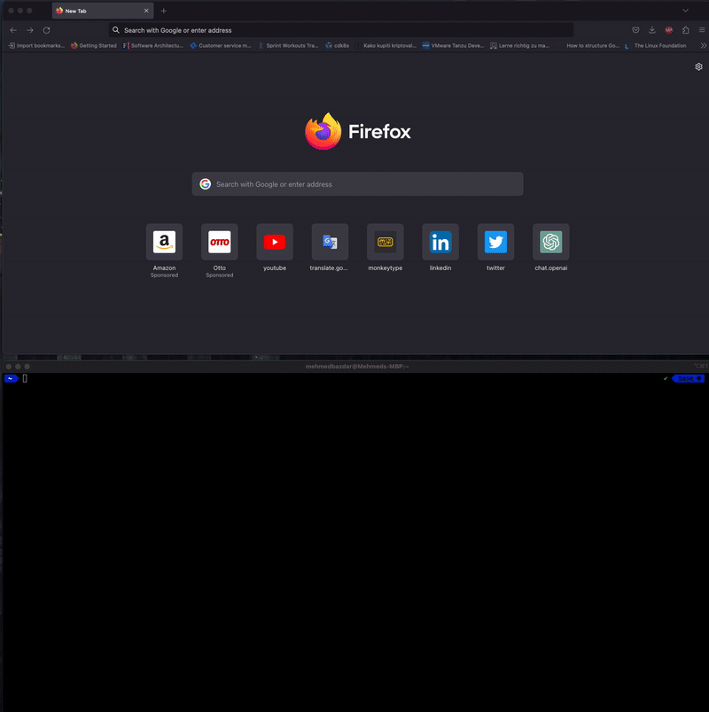
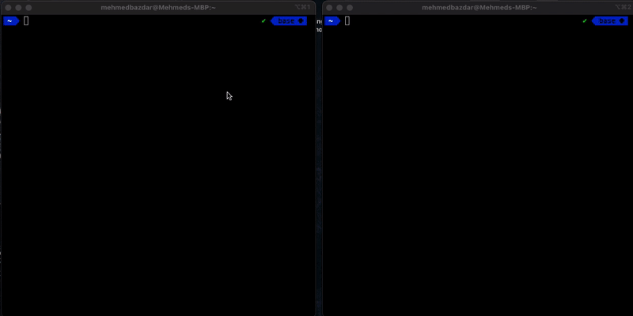

# codesnap.sh

### Description
Simple web app to share code snippets without leaving your terminal. 

#### Upload code demo:



#### Stream code demo:



### Project structure
The project structure is super simple, and it doesn't use a lot of libraries. We use the default multiplexer and
http server from the standard library. There is no need for anything more complex. 

### Running the project

Before running the project, you'll need to generate a private key with ssh-keygen,

```
ssh-keygen
```

The project can be run entirely with docker-compose.

```
docker-compose up -d
```

### Contributions
Contributions are welcome! Please submit a PR or open an issue if you have any suggestions or improvements. 

### License
This project is licensed under the MIT License - see the [LICENSE](LICENSE) file for details
